# Coffee-Shop-Sales- Using Power BI
 
---
# Introduction
A Power BI project analyzing a fictitious coffee shop operating in New York City and to provide insights needed to make informed decisions and pinpoint important areas in need of enhancement and optimization.

# Table Of Content
- [Project Overview](https://github.com/teejay-tems/Coffee-Shop-Sales#project-overview)
- [Project Scope](https://github.com/teejay-tems/Coffee-Shop-Sales#project-scope)
- [Business Objective](https://github.com/teejay-tems/Coffee-Shop-Sales#business-objective)
- [Document Purpose](https://github.com/teejay-tems/Coffee-Shop-Sales#document-purpose)
- [Use Case](https://github.com/teejay-tems/Coffee-Shop-Sales#use-case)
- [Skills/Concept Demonstrated](https://github.com/teejay-tems/Coffee-Shop-Sales#skills-concepts-demonstrated)
- [Data Source](https://github.com/teejay-tems/Coffee-Shop-Sales#data-source)
- [Data Profiling](https://github.com/teejay-tems/Coffee-Shop-Sales?tab=readme-ov-file#data-profiling)
- [Data Cleaning and Processing](https://github.com/teejay-tems/Coffee-Shop-Sales#data-cleaning-and-processing)
- [Data Analysis and Insight](https://github.com/teejay-tems/Coffee-Shop-Sales?tab=readme-ov-file#data-analysis-and-insight) 
- [Data Visualization](https://github.com/teejay-tems/Coffee-Shop-Sales?tab=readme-ov-file#data-visualization)
- [Recommendation](https://github.com/teejay-tems/Coffee-Shop-Sales?tab=readme-ov-file#recommendation)
- [Conclusion](https://github.com/teejay-tems/Coffee-Shop-Sales?tab=readme-ov-file#conclusion)

# Project Overview   
This project seeks to equip the Coffee Shop with actionable insights based on a detailed analysis of Maven Roasters' sales data. It will provide valuable information on product popularity, track sales trends over time, and evaluate the revenue contributions of different store locations. Additionally, the project aims to capture a comprehensive understanding of sales dynamics across various locations within a specified timeframe. By offering a deep dive into these metrics, the project will enable the Coffee Shop to make informed decisions, optimize operations, and strategically drive business growth.

# Project Scope
This project provides a thorough analysis of Maven Roasters' sales data, focusing on key elements like transaction dates, timestamps, locations, and detailed product-level information across all three Maven Roasters locations in New York City. The study aims to deliver an in-depth understanding of sales dynamics and trends across the different locations within the specified timeframe.
The analysis spans data from January 1, 2023, to June 9, 2023, providing a comprehensive overview of the coffee shop's operational performance during this period.

# Business Objective
The primary goal of the coffee shop project is to identify the best-selling and least-selling products, determine which items generate the most revenue, and understand which days of the week are the busiest. Additionally, the project aims to uncover patterns and trends in sales over time.

# Document Purpose
This documentation serves as a guide for project stakeholders, providing insights into the project's objectives, data sources, data analysis, visualization and any other relevant information.

# Use Case
This analysis project for Maven Coffee Shop Sales would provide valuable insights and improvements across various operational aspects. Different stakeholders within the organization could leverage these findings to enhance their respective functions. The following important parties may find this analysis useful and advantageous.

**_1.Customer services representatives:_**
Application of Analysis:  Understanding which days are busiest, and which products are most popular equips customer service teams to better prepare for high-demand periods. With this awareness, teams can allocate resources more efficiently, ensuring quicker responses to customer inquiries and minimizing wait times. 
Benefits: This proactive approach not only enhances the customer experience but also helps in addressing potential issues before they escalate. Ultimately, it leads to smoother operations and higher customer satisfaction

**_2. Management of Operations:_**
Application of Analysis: Executives and top-level managers can utilize the insights gained from the analysis to make well-informed decisions that shape sales strategies and optimize resource allocation. By understanding market trends and customer preferences, they can identify opportunities for growth and areas that require improvement. This data-driven approach enables leaders to align their business direction with customer demands, ensuring that the organization remains competitive in a dynamic market. Ultimately, these strategic decisions contribute to long-term success and sustainability for the business.  

**_3. Marketing Team:_**
By analyzing sales trends and identifying popular products, the marketing team can create targeted campaigns designed to enhance sales and promote high-demand items effectively. These insights enable them to strategically plan marketing initiatives that maximize revenue potential. Additionally, understanding the busiest days and customer preferences allows the team to optimize the timing and content of promotional activities, ensuring that marketing efforts resonate with customers when they are most likely to engage. This tailored approach not only boosts sales but also fosters stronger customer relationships and loyalty.

# Skills/ Concepts Demonstrated
- Data Connection in Microsoft Power BI
- Data Profiling
- Data Cleaning and Transformation in Power Query
- Data Modelling
- Data Analysis
- Data Visualization

# Data Source
 This project uses a dataset that was designed especially for practice and was taken from the [Maven Analytics website](https://www.mavenanalytics.io/data-playground?page=5&pageSize=5). The dataset is provided as a CSV file and consists of a single table with 149,116 rows and 12 columns. Maven Roasters’ sales data is characterized by a wealth of information within this structured framework, offering a nuanced understanding of various aspects of their business operations. Key attributes that are necessary for a thorough analysis are included in the dataset: Product ID, Unit Price, Profit, Product Category, Product Type, Product Detail, Store ID, Store Location, Transaction ID, Transaction Date, Transaction Time, and Transaction Qty. All these factors provide important information, which when combined creates a clear picture of the transactional scenario for Maven Roasters.

**Data Connection Details**

 In Power BI, connecting to a CSV file involves specifying the location of the CSV file and defining the data import settings.
 The procedures for connecting data in Power BI are listed below.

**_1.Open Power BI Desktop_**
- Launched power BI Desktop on computer.
  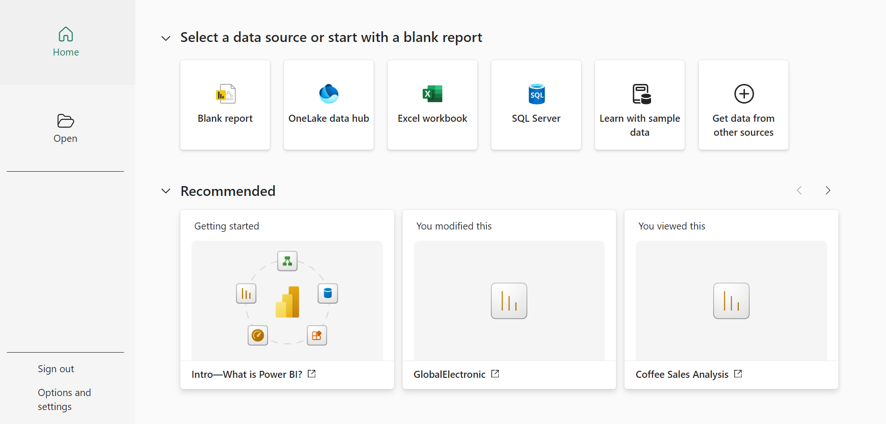    

**_2.Get Data_**
- Clicked on the "Home" tab in the Power BI Desktop.
- Selected "Get Data" to initiate the data import process.
 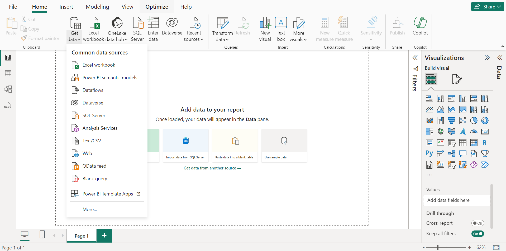

**_3. Choose Text/CSV and Specify the File Location_**
- In the "Get Data" window, select "Text/CSV" as the data source.
- Navigated to the location where the CSV file is stored.
- Selected the CSV file I want to import and clicked "Open."
 

**_4.Preview and Transform_**
- Power BI displayed a preview of the data from the CSV file.
- Reviewed the data to ensure it is displayed correctly.
  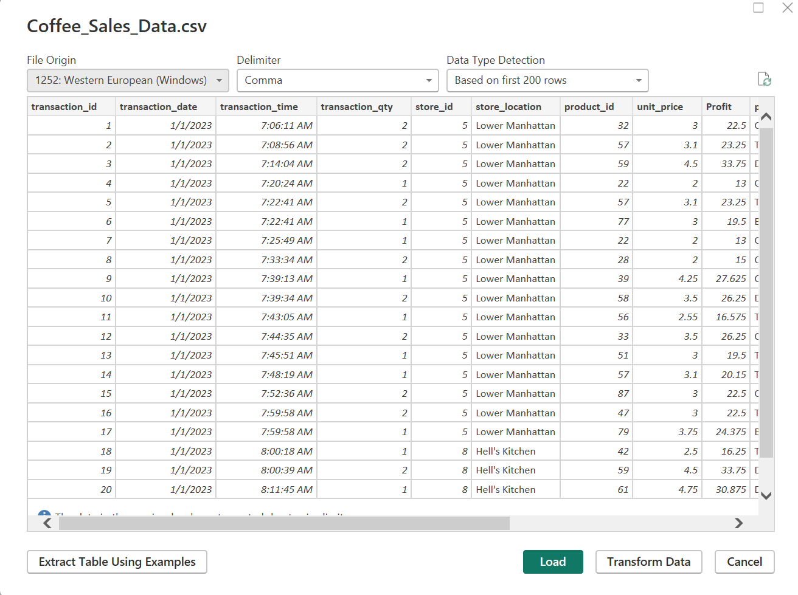

# Data Profiling
 Using Power BI's data profiling feature, one can examine and analyze the qualities and features of data to learn more about its structure, trends, possible problems, and outliers. 
 It helps to make informed decision on data cleaning and transformation. Data profiling is made easier with Power BI's array of features and tools.  These are column quality, column distribution and column profile.

**Data Profile on Key Column on Coffee Sales Table**

**_1.Basic information_**

- Table name: Coffee Sales Table

- Number of Rows: 149,116
- Number of Columns: 12

**_2.Column Profile_**

|Column_Name|Data_Type|Distinct_Value|Unique|NaN|Average|Errors|Empty_Values|Minimum|Maximum|
|-----------|------|--------|---------|--------|-------|----------|---------|--------|------|
|Transaction Qty|Whole Number |2 |0 |0 |1.42|0 |0 |1 |2 |
|Unit Price|Decimal Number |14 |0 |0 |3.11|0 |0 |2 |4.75|
|Profit|Decimal Number |27 |0 |0 |21.51 |0 |0 |13 | 35.62||
|Product Category|Text |4 |0 |- |- |0 |0 |Bakery |Tea |
|Product Type|Text |13 |0 |-|-|0 |0 |Barista Espresso|Scone|
|Product Detail|Text |52 |0 |-|-|0 |0 |Almond Croissant|Traditional  Blend Chai Rg|
|Store Location|Text |3 |0 |0 |-|0 |0 |Astoria|Lower Manhattan|
 
 
**_3. Data Quality Checks_**
Missing Values:
- Transaction ID: 0
- Transaction Date: 0
- Transaction Time: 0
- Transaction Qty: 0
- Product ID: 0
- Unit Price: 0
- Profit: 0
- Product Category: 0
- Product Type: 0
- Product Detail: 0
- Store ID: 0
- Store Location: 0

 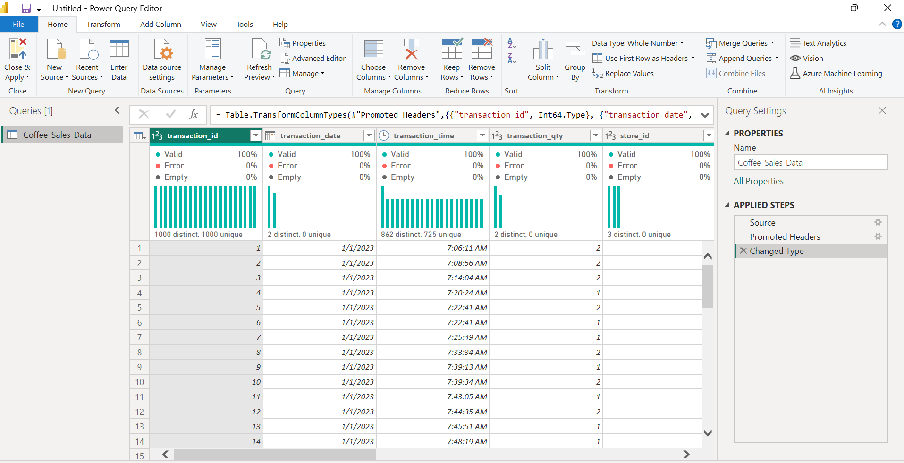

 
# Data Cleaning and Processing
The process of cleaning data in Power BI involves utilizing the Power Query Editor, an effective tool for shaping and modifying data prior to its loading into the Power BI data model. High levels of accuracy, consistency, quality, and integrity can all be attained with the aid of data cleaning. The insight obtained from data profiling indicates that the dataset used in this analysis is well-structured, consistent, and free of significant errors that might complicate analysis or interpretation. Each column has the correct data type assigned to it, the data values are accurate, and there are no duplicate records. Consistent naming conventions and uniform formatting are employed throughout the data.
As a result, no further cleaning is needed. The following process was carried out during data processes.


- **_Added a new column_**
  
The coffee sales data was enriched with six new columns: Year, Month Number, Month Names, Weekday, Week Number, and Quarter, which were added to the Maven Roasters’ sales dataset. These additional columns are crucial in the analysis, enabling a detailed exploration of how Maven Roasters' sales have trended over time. They also play a significant role in identifying the busiest days of the week, helping to uncover the factors driving these patterns. By incorporating these temporal indicators, the dataset's analytical capabilities are enhanced, allowing for a more comprehensive assessment of sales dynamics and patterns across different timeframes.

# Data Analysis and Insight
The primary goal of this analysis is to extract meaningful insights from Maven Roasters' sales data by thoroughly investigating key factors. First, it examines patterns in the data to understand temporal trends in sales over time. Second, a detailed analysis is conducted at the product level to identify the most and least frequently sold items, as well as the specific revenue contributions of each product. Third, the analysis explores the underlying factors influencing transaction volumes on specific days to determine which days of the week consistently see peak activity at Maven Roasters.

This analysis provides answers to the following questions.

**1.How have Maven Roasters sales trended over time?**

This analysis explores trends and changes in the sales performance of the coffee shop, Maven Roasters. It seeks to determine whether the sales have been steadily rising, falling, or fluctuating, in order to understand the overall trajectory of the company’s sales. A DAX (Data Analytics Expressions) measure was created to calculate the total revenue generated by the coffee shop each month. 

**DAX code for calculating Total Revenue.**
```
Total Revenue = SUMX ('Sales Data', 'Sales Data'[transaction_qty]*'Sales Data'[unit_price]) 
```

This measure compiles monthly sales data, providing a concise and comprehensive overview of Maven Roasters' revenue for each month. The insights gained from this calculation help identify trends, variations, and patterns in sales performance over time.
A line chart was used for the visualization to visually represent the dynamic patterns and fluctuations in sales data, providing a clearer and more insightful understanding of the changes within the dataset.


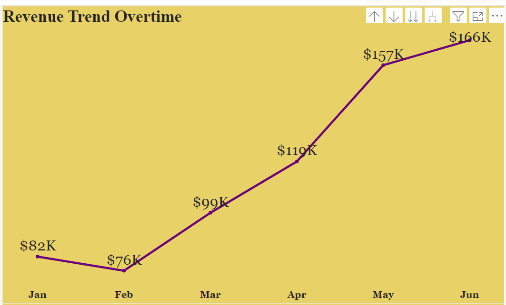  

From the above analysis,
- There is a consistent increase in total revenue from January to June, indicating a positive sales trend over the six-month period. 
- Revenue saw a significant rise from March to June, possibly due to seasonal factors or increased customer activity during this time. 
- June stands out with the highest revenue, suggesting a surge in sales or the success of promotions during that period.
  

**2.Which days of the week tend to be busiest, and why do you think that's the case?**

This involves analyzing the sales data to determine which days of the week the coffee shop experiences higher levels of business activity and to uncover potential reasons behind these patterns. To address this, the first step is to identify the busiest day of the week. The analysis required creating a measure to calculate the total revenue generated on each day. This was done by summing the sales amounts from all transactions, providing a quantitative measure of the financial impact for each day.

The chart below provided a clear visual representation of sales activity for each specific day. By identifying the day with the highest total revenue, it was revealed that Monday is the busiest weekday, generating the most revenue at $101.68k, followed closely by Friday with $101.37k. This indicates that Monday is the most profitable day for the business in terms of sales.

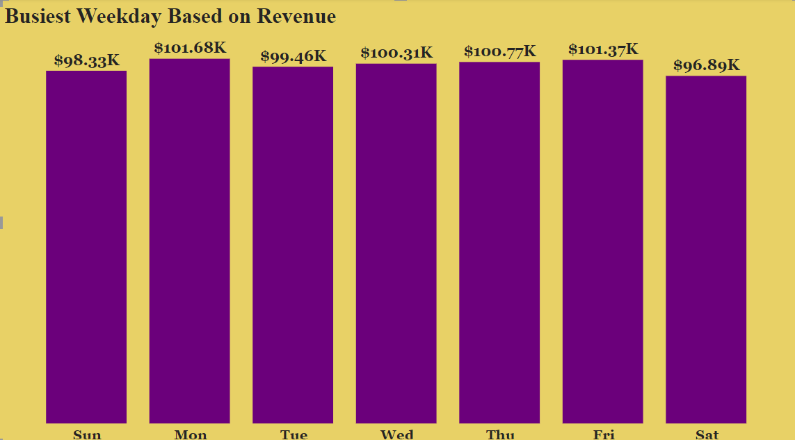

I conducted a follow-up analysis to identify which store locations generated the most revenue. Using the same methodology, I analyzed revenue trends across various store locations with a waterfall chart. Hell's Kitchen emerged as the top-performing store, generating $236.51k in sales, indicating a high level of customer activity. Lower Manhattan followed closely with $230.06k in revenue, while Astoria generated $232.24k.

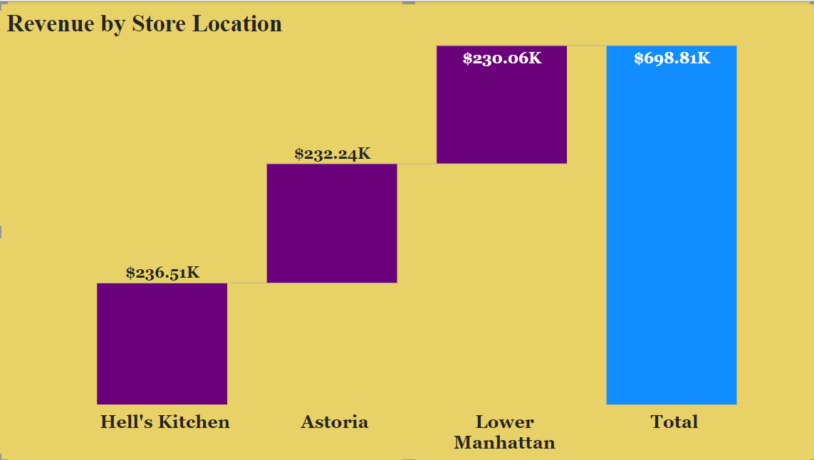


**3.Which products are sold most and least often? Which drive the most revenue for the business?**

This analysis aims to understand the popularity and financial impact of different products on the coffee shop's overall performance. By identifying the top-selling, least-selling, and highest-revenue-generating products, the business can make informed decisions regarding inventory management, marketing strategies, and potential promotions or adjustments to product offerings. A measure was created to calculate the total quantity sold for each product, and a bar chart was used as a visualization tool to display the results. To enhance clarity and highlight significant insights, a filter pane was applied to showcase only the top five best-selling products and the five least-selling products, based on quantity sold.

**DAX code for calculating Total Quantity**
```
Total Quantity = SUM('Sales Data'[transaction_qty])
```

# Top 5 Selling Product
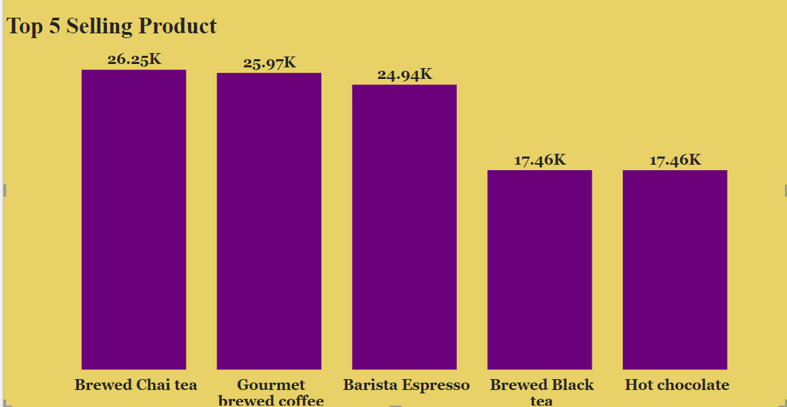

- With the highest quantity sold at 26,250 units, Brewed Chai Tea leads in sales, indicating that it is a customer favorite and a potential key revenue driver.
- Gourmet Brewed Coffee, Barista Espresso, Brewed Black Tea, and Hot Chocolate also have relatively high quantities sold, suggesting consistent demand across the board. Although these products are not the top sellers, their substantial sales indicate ongoing popularity and significant contributions to overall revenue.

# Least 5 Selling Product
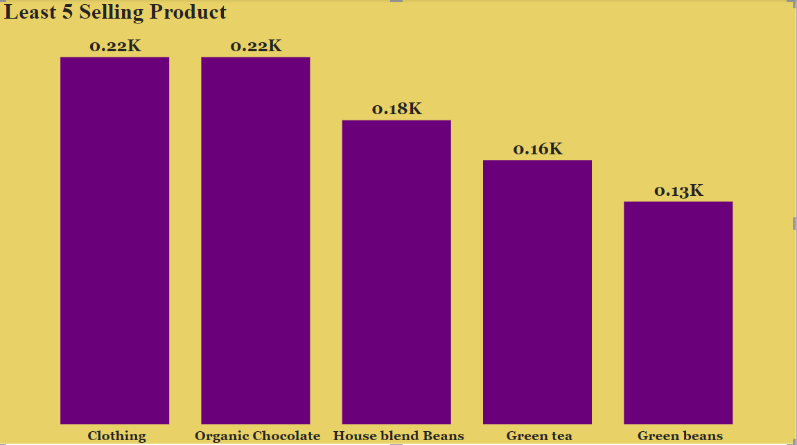  

- With the lowest quantity sold at 221 units, clothing stands out as the least-performing product in terms of sales. 
- Organic chocolate, house blend beans, green tea, and green beans also show lower quantities sold, indicating reduced demand compared to other items.

# Best Selling Product by Revenue

This determination focuses on identifying products that contribute to the business's revenue. The analysis considers not only transaction frequency but also the interplay between product price and transaction quantity for each item, offering a comprehensive understanding of the key revenue drivers.
A measure was created to calculate the total revenue generated by each product, which was then used alongside a bar chart to visually represent the results. To streamline the presentation and emphasize key insights, a filter pane was employed to display only the top five best-selling products based on revenue. This approach provides a clear and focused view of product performance, facilitating strategic decision-making and actionable insights.

**DAX code for calculating Total Revenue**
```
Total Revenue = SUMX ('Sales Data','Sales Data'[transaction_qty]*'Sales Data'[unit_price])
```

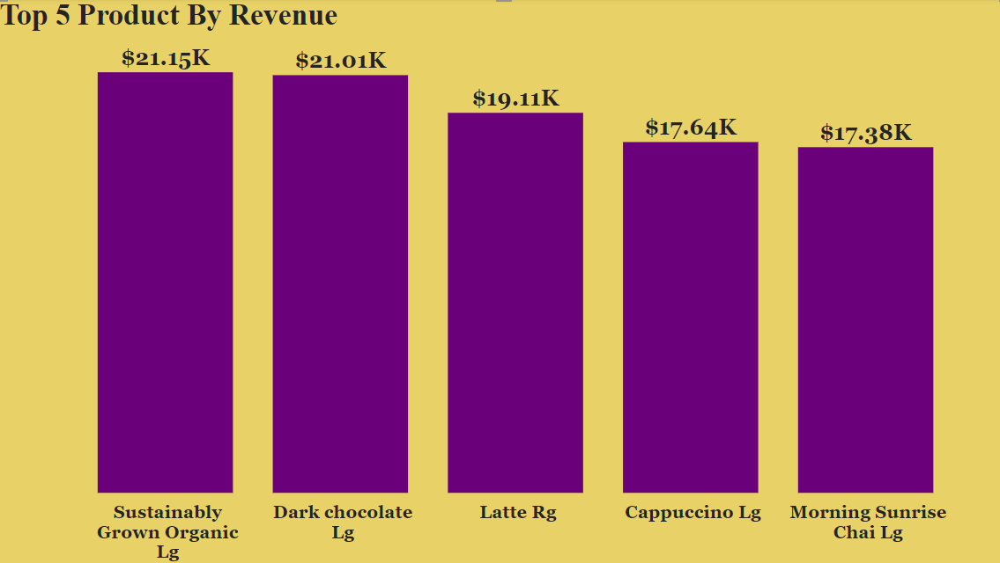    

- The products that generate the most revenue is Sustainably Grown Organic Large and Dark Chocolate Large, with Sustainably Grown Organic Large slightly leading with total revenue of $21,152. Although they do not generate the highest revenue, Morning Sunrise Chai Large, Cappuccino Large, and Latte Regular all show respectable revenue figures, indicating that they remain popular among consumers.

# Data Visualization
This data visualization was created using Power BI, each visual created displays information for each question in the business objective.

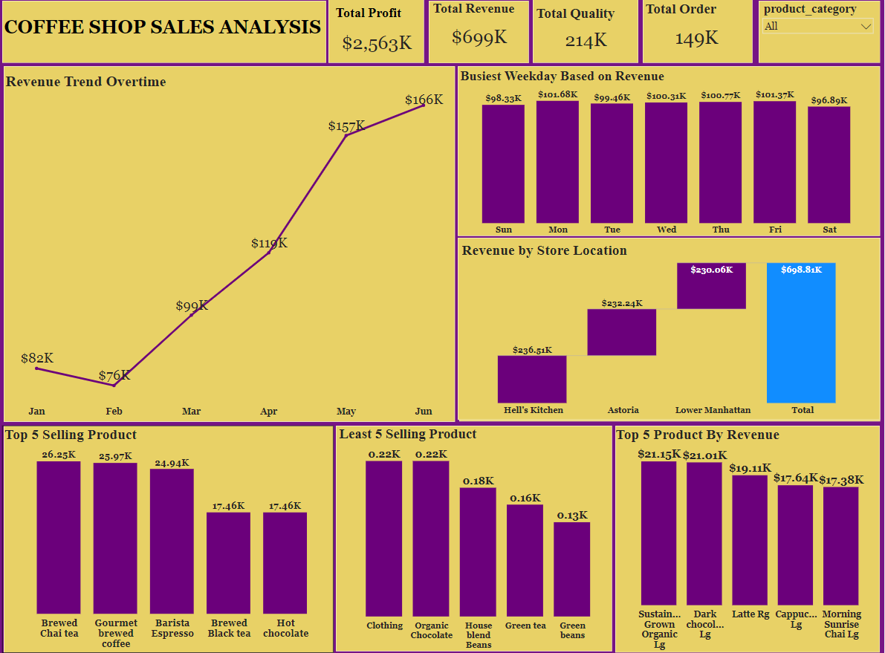 

You can interact with the report [Here]().

# Recommendation

Here are some recommendations to enhance product performance and sales:

**_1.	Promote Flagship Products:_** Brewed Chai Tea and Gourmet Brewed Coffee should be highlighted as flagship products. Consider launching special promotions, combo deals, or targeted marketing campaigns to increase their visibility and drive sales.

**_2.	Reassess Pricing Strategy:_** Evaluate the pricing strategy for the least-selling products. If pricing contributes to lower sales, consider adjusting prices to better align with customer expectations while still ensuring profitability.

**_3.	Conduct Customer Surveys:_** Implement customer surveys to gather specific feedback on underperforming products. Understanding customer preferences and areas for improvement will help identify changes needed to enhance product appeal.

**_4.	Leverage Growth Momentum:_** Given the strong growth in June, it’s essential to maintain a focus on successful strategies and explore additional efforts to sustain or accelerate this growth.

**_5.	Gather Continuous Feedback:_** Collect feedback from customers during both growth and decline periods. Understanding customer preferences, needs, and concerns can provide valuable insights for tailoring products and services to meet market demands effectively.


# Conclusion
Incorporating these findings into Maven Roasters' strategic decision-making processes will empower the business to leverage its strengths, address areas for improvement, and uphold a customer-centric approach. By doing so, Maven Roasters can achieve sustained success in the competitive coffee shop market. This strategic alignment will not only enhance overall performance but also foster long-term customer loyalty and growth.


